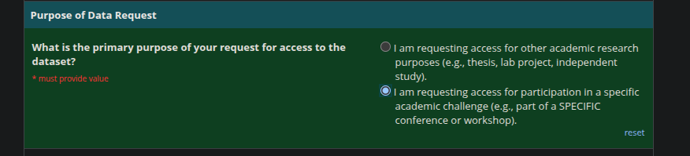
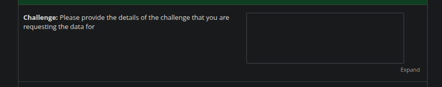
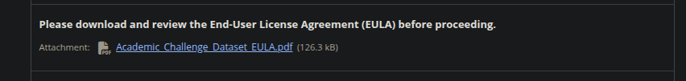
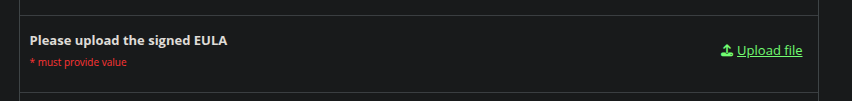
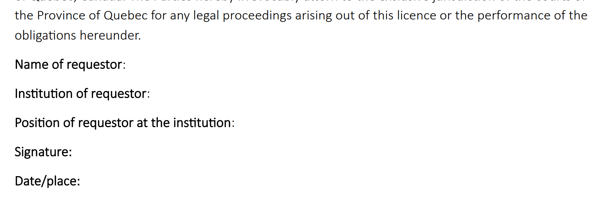

# [Registration in the Ambivalence/Hesitancy (AH) Video Recognition Challenge, ABAW10th, CVPR2026](https://affective-behavior-analysis-in-the-wild.github.io/10th/#counts1)

- Challenge website: [https://affective-behavior-analysis-in-the-wild.github.io/10th/#counts1](https://affective-behavior-analysis-in-the-wild.github.io/10th/#counts1)
- Code in `bah_metrics.py` will be used for evaluation. Teams can use it to evaluate their models on the public BAH test set.


## BAH dataset:
```
@inproceedings{gonzalez-26-bah,
  title={{BAH} Dataset for Ambivalence/Hesitancy Recognition in Videos for Digital Behavioural Change},
  author={González-González, M. and Belharbi, S. and Zeeshan, M. O. and
    Sharafi, M. and Aslam, M. H and Pedersoli, M. and Koerich, A. L. and
    Bacon, S. L. and Granger, E.},
  booktitle={ICLR},
  year={2026}
}
```


If you want to participate in the **AH Video Recognition Challenge**, you should follow the below procedure for registration. Your registration is an automatic request of the *BAH* dataset cited above needed for training. Once we receive your resigration, we will send you access details for the *BAH* dataset.

The registration consists in filling a form and signing a End-User License Agreement (EULA) to be uploaded in the form.


```diff
- PLEASE FILL IN THE DATASET REQUEST FORM CAREFULLY TO AVOID ERRORS/DELAYS.
- PLEASE FOLLOW THE NEXT INSTRUCTIONS.
```

* Who can register? **only** full-time faculty position (for example: Assistant Professor, Associate Professor, or Professor) at a university, higher education institution, or equivalent organisation can register (fill in the form and sign the EULA). The applicant must include the names of all the team members participating in the challenge. The applicant cannot be a student (UG/PG/Ph.D./Postdoc).

<p align="center"></p>

* All form fields with "* must provide value" are mandatory.

* "Email" field: please enter your permanent faculty email address.

<p align="center"></p>

* Please list the names of everyone who is member of the team in the challenge, and will have access to the dataset.

<p align="center"></p>


* For the certification: `I certify that neither myself nor any of my research team are directly associated with an institution or organisation on Canada's Named Research Organisations List (see https://science.gc.ca/site/science/en/safeguarding-your-research/guidelines-and-tools-implement-research-security/sensitive-technology-research-and-affiliations-concern/named-research-organizations).`

```diff
- PLEASE ENSURE THAT THE AFFILIATION OF THE MAIN APPLICANT AND ANYONE HAVING
- ACCESS TO THE DATASET DOES NOT SHOW ON THE LIST OF ORGANIZATIONS LISTED IN THE LINK.
- IF YOU CHOOSE `NO` AS ANSWER, UNFORTUNATELY, THE REGISTARTION IS NULL AND DATASET CAN NOT BE PROVIDED DUE
- TO LEGAL AND ETHICAL REASONS OUT OF OUR CONTROL.
```
<p align="center"></p>

Search affiliations/institutions/organisations in the provided link [https://science.gc.ca/site/science/en/safeguarding-your-research/guidelines-and-tools-implement-research-security/sensitive-technology-research-and-affiliations-concern/named-research-organizations](https://science.gc.ca/site/science/en/safeguarding-your-research/guidelines-and-tools-implement-research-security/sensitive-technology-research-and-affiliations-concern/named-research-organizations):

<p align="center"></p>


* For the question `What is the primary purpose of your request for access to the dataset?`:

```diff
- PLEASE CHOOSE THE OPTION: "I am requesting access for participation in a specific academic
- challenge (e.g., part of a SPECIFIC conference or workshop)."
```

<p align="center"></p>


* Challenge: please provide some details about the challenge.

<p align="center"></p>


* EULA: please download the EULA, read it, fill it, and sign it (handwritten signature), then upload it.

<p align="center"></p>
<p align="center"></p>
<p align="center"></p>


* If you have questions while filling in the form, please contact us.


* Form link: [https://www.crhscm.ca/redcap/surveys/?s=LDMDDJR3AT9P37JY](https://www.crhscm.ca/redcap/surveys/?s=LDMDDJR3AT9P37JY)
